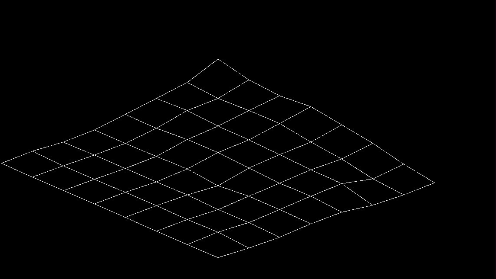

# Raise the terrain



Raise the Terrain is a project that generate a graph with given data. Taking into account coordenates (x, y, z). </br>
Developed with C lenguage and sdl2 library.

## Install

``` bash
$ git clone https://github.com/AlejoCasti/Raise_the_terrain.git
```

## Execution

Make sure that you are running on Ubunutu interface.

``` bash
$ gcc main.c -o raise_terrain
$ ./raise_terrain
```

